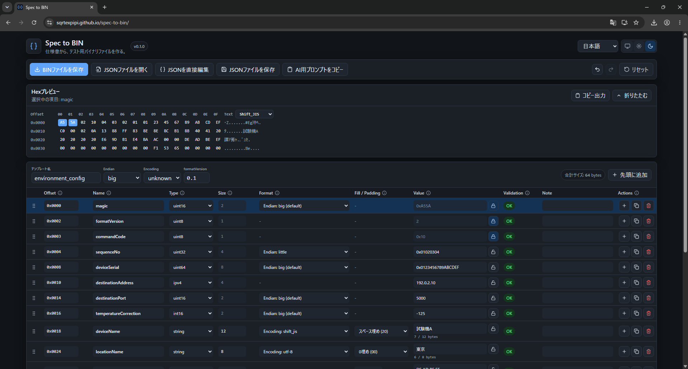

# Spec to BIN

[English](./README.md) | [日本語](./README.ja.md)

仕様書から、テスト用バイナリファイルを作る。

Spec to BINは、共有可能なJSON定義から固定長のテスト用バイナリファイルを生成する、無料のオープンソース・ブラウザアプリです。通信電文、組込み設定データ、EEPROMデータ、初期設定BIN、テストデータの作成を想定しています。

JSON定義をGitなどでチーム共有し、同じSpec to BINバージョンと同じ定義から同じBINを再現できます。JSON、入力値、生成BINはブラウザ内で処理し、アプリから外部へアップロードしません。Web版、PWA、単一HTMLのオフライン版を利用できます。

一般的なHex Editorではありません。バイナリ構造を定義し、GUIで値を確認・編集し、エラーを検証し、Hexをプレビューして、最終的に `.bin` を保存することを目的にしています。

- **[Web/PWA版を開く](https://sqrtexpipi.github.io/spec-to-bin/)**
- **[オフライン版を取得する](https://github.com/SqrtExpipi/spec-to-bin/releases/latest)**
- **[利用ガイドを読む](./docs/user-guide.ja.md)**

同梱プロンプトを任意の外部チャットAIへ渡し、仕様書からJSON定義のたたき台を作ることもできます。Spec to BIN自体はAI APIを呼び出しません。人間が定義を確認し、アプリがブラウザ内で検証して決定的にbyte列を生成します。


<details>
<summary>その他のスクリーンショット</summary>

### ダークテーマ



### 入力エラー表示


</details>

## プライバシー

- ブラウザ内で処理します。
- JSONテンプレート、生成BIN、入力値、仕様情報をアップロードしません。
- テレメトリはありません。
- 初期版ではAI API連携を内蔵しません。
- リリース版には単一HTMLのオフラインZIPを含めます。

## v0.1 の機能

- JSONバイナリテンプレートの読込・保存
- 表上でName、Type、Size、Format、Value、Note、期待Offsetを編集
- 行の並び替え、追加、複製、削除
- Undo/Redoと未保存警告
- Offsetとbyteサイズの表示
- 問題のある行の直下にバリデーションを表示
- 期待Offsetと計算Offsetの照合
- 表の上で生成Hexをプレビューし、選択項目の範囲を強調
- 生成byteを変更せず、文字プレビューをASCII・UTF-8・Shift_JISで切り替え
- 生成byte列を `0x` リスト、通常Hex、C配列、Python `bytes`、C# `byte[]` としてコピー
- `.bin` 保存
- 日本語/英語UI
- システム/ライト/ダークテーマ
- PWA・オフライン対応

## 対応フィールド型

- `uint8`
- `uint16`
- `uint32`
- `uint64`（値はJSON文字列）
- `int8`
- `int16`
- `int32`
- `int64`（値はJSON文字列）
- `bytes`
- `string`
- `ipv4`
- `padding`

## 対応ブラウザ

現在のリリースは、Google ChromeとMicrosoft Edgeの最新安定版を対象としています。その他のブラウザでも動作する可能性はありますが、v0.1のテスト対象外です。

## 既知の制限

- CRCとチェックサムは自動計算しません。計算済みの値を通常の数値型または`bytes`型として入力してください。
- 既存BINからテンプレートを逆生成することはできません。
- 繰り返し構造、可変長構造、bit field、浮動小数点、条件付きフィールドには対応していません。
- Web/PWA版はHTTP(S)での配信が必要です。`file://`で直接開く場合や完全オフラインで使う場合はリリースZIPを使用してください。
- プレビューとテキストコピー出力には意図的な上限があります。生成BINの上限内であれば、それを超える有効なBINも保存できます。

## 開発

```bash
npm install
npm run dev
```

## ビルド

```bash
npm run build
```

`dist` はWeb/PWA配信用です。HTTP(S)サーバーで配信してください。`file://` で直接開く用途ではありません。

## オフラインビルド

```bash
npm run build:offline
```

`dist-offline/index.html` はブラウザで直接開けます。JavaScriptとCSSを1ファイルに埋め込んでいます。GitHubのタグ付きリリースでは、この出力をオフラインZIPにします。

## テスト

```bash
npm run test:run
```

## サンプル

初期画面は空のテンプレートで開きます。初期画面の「サンプルを開く」から一般的なフィールド型のサンプルを読み込めます。公開している個別サンプルは [`examples`](./examples) にあります。

## 安全上の上限

- JSONファイル・直接編集: 5 MiB
- 項目数: 5,000
- 1つの可変長項目: 16 MiB
- 生成BIN: 64 MiB
- Hexプレビュー: 先頭8 KiB
- テキストコピー出力: 64 KiB

未知のJSONプロパティは可能な限り保持し、警告として表示します。エラーがある場合はプレビュー、コピー、BIN保存を停止し、警告だけなら生成できます。

## ドキュメント

- [利用ガイド（日本語）](./docs/user-guide.ja.md)
- [User guide（英語）](./docs/user-guide.md)
- [Template format](./docs/template-format.md)
- [JSON Schema](./docs/binary-template.schema.json)
- [変更履歴](./CHANGELOG.md)
- [リリースチェックリスト](./docs/release-checklist.md)
- [AI prompt example（日本語）](./prompts/spec-to-bin-json.ja.md)
- [AI prompt example（英語）](./prompts/spec-to-bin-json.md)
