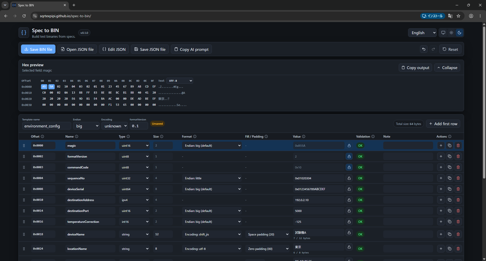

# Spec to BIN

[English](./README.md) | [日本語](./README.ja.md)

Build test binaries from specs.

Spec to BIN is a free, open-source browser tool for generating fixed-layout test binary files from shared JSON definitions. It is designed for communication packets, embedded settings, EEPROM images, initialization data, and test fixtures.

Teams can version JSON templates in Git and reproduce the same binary from the same definition with the same Spec to BIN version. Processing stays in the browser: the app does not upload templates, field values, or generated BIN files. Use it on the web, install it as a PWA, or download a self-contained offline HTML release.

It is not a general-purpose hex editor. The goal is to reduce manual hex editing by letting you define binary structure, edit values in a GUI, validate errors, preview bytes, and export `.bin` files.

- **[Open the web/PWA app](https://sqrtexpipi.github.io/spec-to-bin/)**
- **[Download the offline release](https://github.com/SqrtExpipi/spec-to-bin/releases/latest)**
- **[Read the user guide](./docs/user-guide.md)**
- **[利用ガイド（日本語）](./docs/user-guide.ja.md)**

An optional external chat AI can turn a specification into a draft JSON definition using the included prompt. Spec to BIN itself does not call an AI API: a person reviews the definition, and the app validates it and generates bytes deterministically in the browser.


<details>
<summary>More screenshots</summary>

### Dark theme



### Inline validation


</details>

## Privacy

- Runs locally in your browser.
- No upload of JSON templates, generated BIN files, field values, or specification-derived data.
- No telemetry.
- No built-in AI API integration.
- Release builds include a self-contained offline ZIP.

## Features in v0.1

- Load and save JSON binary templates
- Edit names, types, sizes, formats, values, notes, and expected offsets in a table
- Reorder, add, duplicate, and delete fields
- Select multiple rows to copy, duplicate, move, delete, or expand a record block with numbered names
- Copy selected rows to the internal clipboard and paste them below the active row
- Generate valid fixed-length string test values by encoded byte length, including exact maximum and one-byte-short cases
- Undo and redo edits, restore the last opened or saved definition, and start a clean template
- Show offsets and byte sizes
- Show field validation directly below the affected row
- Validate expected offsets against calculated offsets
- Preview generated hex bytes above the editor and highlight the selected field
- Switch the text preview between ASCII, UTF-8, and Shift_JIS without changing generated bytes
- Copy generated bytes as `0x` list, plain hex, C array, Python `bytes`, or C# `byte[]`
- Compare generated bytes with an existing BIN and locate differences by field
- Show SHA-256 hashes for both generated and compared binaries
- Save `.bin`
- English and Japanese UI
- System, light, and dark themes
- PWA and offline use

## Supported field types

- `uint8`
- `uint16`
- `uint32`
- `uint64` (JSON string value)
- `int8`
- `int16`
- `int32`
- `int64` (JSON string value)
- `bytes`
- `string`
- `ipv4`
- `padding`

## Supported browsers

The current release targets the latest stable versions of Google Chrome and Microsoft Edge. Other browsers may work, but are not part of the v0.1 test scope.

## Known limitations

- CRC and checksum fields are not calculated automatically. Enter precomputed values as ordinary numeric or byte fields.
- Existing BIN files cannot be parsed back into templates. They can be compared with the current generated result.
- JSON repeat structures are not supported. The GUI can expand selected rows into ordinary flat `fields`.
- Variable-length structures, bit fields, floating-point fields, and conditional fields are not supported.
- The web/PWA build must be served over HTTP(S). Use the release ZIP when direct `file://` and offline operation are required.
- Preview and text-copy output are intentionally capped; larger valid binaries can still be saved within the generated-binary limit below.

## Quick start

```bash
npm install
npm run dev
```

## Build

```bash
npm run build
```

`dist` is the web/PWA build and must be served over HTTP(S). It is not intended to be opened directly with `file://`.

## Offline build

```bash
npm run build:offline
```

Open `dist-offline/Spec-to-BIN-Offline.html` directly in a browser. The JavaScript and CSS are embedded in that one file. Tagged GitHub releases package it with a readme and license as `spec-to-bin-offline-vX.Y.Z.zip`.

## Test

```bash
npm run test:run
```

## Sample JSON

The editor starts with a blank template. Load the general-purpose sample from the empty state, or use a JSON template such as:

```json
{
  "formatVersion": "0.1",
  "name": "basic_fields",
  "defaultEndian": "big",
  "defaultEncoding": "utf-8",
  "fields": [
    {
      "name": "unsignedValue",
      "type": "uint16",
      "offset": 0,
      "value": "0x000F"
    },
    {
      "name": "label",
      "type": "string",
      "offset": 2,
      "length": 8,
      "encoding": "utf-8",
      "padding": "zero",
      "value": "SAMPLE"
    }
  ]
}
```

More examples are available in [`examples`](./examples).

## Safety limits

- JSON file/editor input: 5 MiB
- Fields: 5,000
- One variable-size field: 16 MiB
- Generated binary: 64 MiB
- Hex preview: first 8 KiB
- Text copy formats: 64 KiB

Unknown JSON properties are preserved when possible and reported as warnings. Errors block preview, copy, and BIN export; warnings do not.

## Documentation

- [User guide](./docs/user-guide.md)
- [利用ガイド（日本語）](./docs/user-guide.ja.md)
- [Template format](./docs/template-format.md)
- [JSON Schema](./docs/binary-template.schema.json)
- [AI prompt example (English)](./prompts/spec-to-bin-json.md)
- [AI prompt example (Japanese)](./prompts/spec-to-bin-json.ja.md)
- [README（日本語）](./README.ja.md)

## Deferred features

These are intentionally outside the first version:

- Built-in AI API integration
- TCP/UDP send
- Existing BIN reverse parsing
- CRC/checksum
- repeat structures in the JSON format (GUI expansion to flat fields is supported)
- lengthOf/countOf/offsetOf auto fields
- batch generation
- CLI
- desktop executable

## License

MIT
