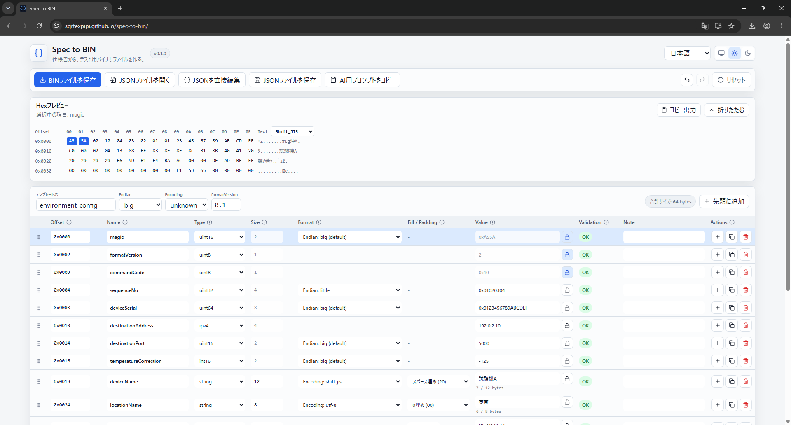
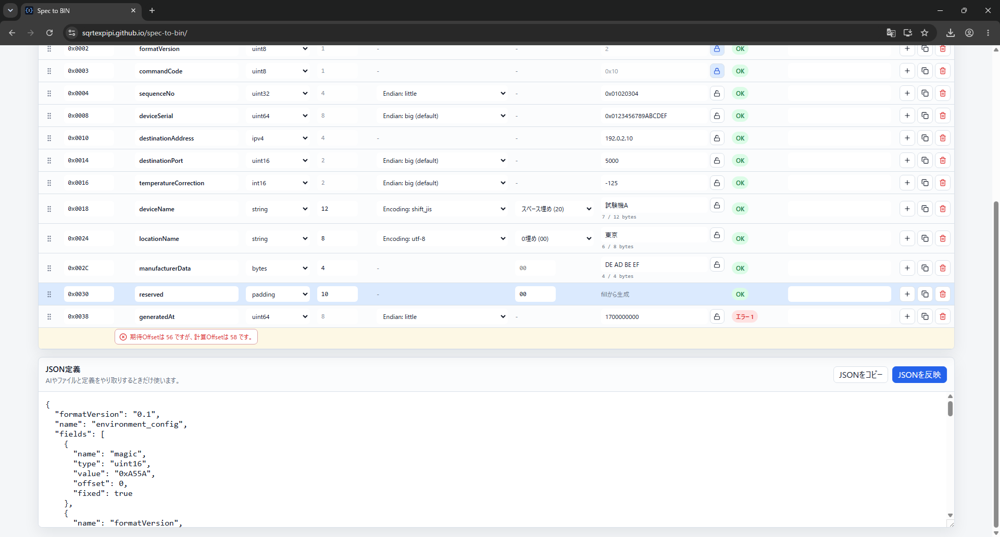

# Spec to BIN 利用ガイド

Spec to BINは、構造化したJSON定義からテスト用バイナリファイルを生成するブラウザツールです。通信電文、組込み設定データ、EEPROMデータ、初期設定BIN、テストペイロードなどの作成を想定しています。

一般的なHex Editorとは異なり、既存BINの解析ではなく、フィールド構造を定義して値を編集し、検証済みの`.bin`を生成することが主な用途です。

- [Web版を開く](https://sqrtexpipi.github.io/spec-to-bin/)
- [テンプレート形式の詳細](./template-format.md)
- [JSON Schema](./binary-template.schema.json)

## 1. データの取り扱い

入力したJSON、フィールド値、生成したBINはブラウザ内で処理されます。アプリからサーバーへのアップロードやテレメトリ送信は行いません。

ただし、仕様書を外部AIへ渡す場合や、GitHub IssueへJSONを掲載する場合はSpec to BINの外部での操作になります。顧客仕様、認証情報、社内プロトコル、実運用データを外部サービスへ送信しないでください。

## 2. Web版とオフライン版

| 種類 | 用途 | 開き方 |
| --- | --- | --- |
| Web/PWA版 | 通常利用、最新版をすぐ使う | 公開URLをChromeまたはEdgeで開く |
| オフラインZIP版 | 閉域環境、ローカルファイルとして保管 | [Releases](https://github.com/SqrtExpipi/spec-to-bin/releases)からZIPを取得し、展開後の`Spec-to-BIN-Offline.html`を開く |

Web/PWA版を保存しただけの`dist/index.html`は`file://`で直接開けません。直接開く用途では、Releaseに含まれる自己完結型オフラインZIPを使用してください。

## 3. 最短の使い方

1. **JSONファイルを開く**からテンプレートを読み込みます。
2. 表のValueや必要な定義を編集します。
3. 各行のValidationが`OK`であることを確認します。
4. Hexプレビューで生成byteを確認します。
5. **BINファイルを保存**を押します。
6. 定義も残す場合は**JSONファイルを保存**を押します。

エラーが残っている間は、誤ったBINを生成しないようプレビュー、コピー、BIN保存が停止します。警告だけの場合は生成できますが、内容を確認してください。

## 4. 画面構成



### ツールバー

| 操作 | 説明 |
| --- | --- |
| BINファイルを保存 | 検証済みのbyte列を`.bin`として保存します。 |
| JSONファイルを開く | 既存のテンプレートJSONを読み込み、現在の表を置き換えます。未保存の変更がある場合は確認します。 |
| JSONを直接編集 | AIやファイルと定義を受け渡すためのJSON編集領域を開きます。編集後は**JSONを反映**します。 |
| JSONファイルを保存 | 現在のテンプレート定義と値をJSONとして保存します。BIN保存とは別操作です。 |
| AI用プロンプトをコピー | 現在のテンプレート契約に合わせたAI向け指示をコピーします。 |
| Undo / Redo | 表やテンプレートへの直前の変更を戻す、またはやり直します。 |
| リセット | 空のテンプレート、または一般的な型を含むサンプルへ置き換えます。 |

### Hexプレビュー

生成されるbyteをOffset、Hex、テキストとして表示します。表で行を選択すると、そのフィールドに対応するbyteが強調されます。

テキスト表示はASCII、UTF-8、Shift_JISから手動で選択できます。この切り替えは右側の読み方だけを変え、生成byteには影響しません。数値byteが文字として表現できない場合は`.`などで表示されます。

**コピー出力**では次の形式をまとめて確認し、必要なものだけコピーできます。

- `0xDE, 0xAD, 0xBE, 0xEF`
- `DE AD BE EF`
- C配列
- Python `bytes`
- C# `byte[]`

## 5. テンプレート全体の設定

| 設定 | 説明 |
| --- | --- |
| テンプレート名 | JSONの`name`です。BINやJSONの既定ファイル名に使われます。 |
| Endian | 個別指定がない複数byte数値型の既定byte順です。 |
| Encoding | 個別指定がない文字列型の既定文字コードです。 |
| formatVersion | テンプレート形式のバージョンです。v0.1では`0.1`を使用します。 |

`unknown`はAIが判断できなかった状態を明示する値です。生成時の既定値ではありません。必要なEndianまたはEncodingが`unknown`のままだとエラーになります。

## 6. 表の編集

各行が出力順の1フィールドです。Offsetは行順とSizeから自動計算されます。

- 左端のハンドルをドラッグして行順を変更します。
- `+`でその行の直下に新しい行を追加します。
- 複製ボタンで現在の行をコピーします。
- ごみ箱ボタンで行を削除します。
- **先頭に追加**で先頭行を作成します。

行の追加・複製・並べ替え後は、後続フィールドの計算Offsetも変わります。

### 複数行の一括操作

各行の左端にあるチェックボックスを選ぶと、一括操作バーが表示されます。選択行の複製、エディタ内コピー・貼り付け、上下移動、削除、および選択範囲を1レコードとした繰り返し展開ができます。

**繰り返し**は新しいJSON型を追加せず、従来の平坦な`fields`へ展開します。回数は元データを含む合計レコード数です。名前は変更なし、`_1` / `_01`の追加、既存末尾連番の増加から選べます。展開結果を連続した期待Offsetにしたい場合はOffset再計算を有効にします。

**テスト値を生成**は、選択したロックされていない固定長`string`項目だけに適用します。各項目の実効EncodingとSizeをbyte単位で使用します。半角・全角最大、現在値を残して補完、指定文字、英字・数字、空文字、末尾1 Byte空け、1 Byte超過を選べます。全角文字だけで長さが一致しない場合は、半角で補完、最大長未満、スキップから選択します。

### Offset

Offset欄は、仕様書に記載された**期待Offset**です。フィールドの配置位置を直接変更する値ではありません。

```text
実際のOffset = それより前にある全フィールドのSize合計
```

期待Offsetと計算Offsetが違うとエラーになります。仕様書上に空き領域がある場合、Offsetだけを飛ばすのではなく、その長さの`padding`フィールドを途中へ追加します。

### Size

数値型と`ipv4`は型から自動決定されます。`bytes`、`string`、`padding`ではJSONの`length`に対応し、byte単位で編集できます。

### 固定値

Value横の鍵ボタンはJSONの`fixed`に対応します。固定値を誤って通常操作で変更しないためのUI上のロックです。JSON自体の改変を防止するセキュリティ機能ではありません。

### NoteとneedsReview

Noteは仕様上の注意やAIが判断できなかった理由を残す欄です。JSONで`needsReview: true`になっている行は、人間が確認して解消するまでBIN保存を停止します。確認後はJSON直接編集などで`needsReview`を削除するか`false`にします。

## 7. フィールド型

| 型 | Size | 入力例 | 用途 |
| --- | ---: | --- | --- |
| `uint8` | 1 | `15`, `0x0F`, `F` | 符号なし8bit整数 |
| `uint16` | 2 | `5000`, `0x1388` | 符号なし16bit整数 |
| `uint32` | 4 | `0x01020304` | 符号なし32bit整数 |
| `uint64` | 8 | JSONでは`"0x0123456789ABCDEF"` | 符号なし64bit整数 |
| `int8` | 1 | `-10` | 符号付き8bit整数 |
| `int16` | 2 | `-125`, `-0x10` | 符号付き16bit整数 |
| `int32` | 4 | `-100000` | 符号付き32bit整数 |
| `int64` | 8 | JSONでは`"-9223372036854775808"` | 符号付き64bit整数 |
| `bytes` | `length` | `DE AD BE EF` | 明示したbyte列、または同一byteの反復 |
| `string` | `length` | `通信` | 固定byte長文字列 |
| `ipv4` | 4 | `192.0.2.10` | IPv4アドレス |
| `padding` | `length` | fill: `00` | 予約・未使用領域 |

Port専用型はありません。通常は仕様のbyte数に合わせて`uint16`などを使用します。

## 8. 数値とEndian

数値は次の形式で入力できます。

| 入力 | 解釈 |
| --- | --- |
| `15` | 10進数15 |
| `0010` | 10進数10 |
| `0x0010` | 16進数0x10（10進数16） |
| `F`, `7FFF` | A-Fを含むため16進数 |
| `-0x10`, `-A` | 負の16進数 |

数字だけの入力は10進数です。16進数であることを明確にしたい場合は`0x`を付けてください。

`uint64`と`int64`はJavaScriptの数値精度による破損を避けるため、JSONでは値を必ず文字列にします。GUIでは通常どおり入力できます。

Endianは複数byte数値の並び順です。例えば`uint16`の`0x1234`は次のようになります。

```text
big:    12 34
little: 34 12
```

`uint8`、`int8`、`ipv4`、`bytes`、通常の文字列には数値Endianを適用しません。

## 9. bytes、fill、padding

### bytes.value

個々のbyteを明示します。次の形式を受け付けます。

```text
DEADBEEF
DE AD BE EF
DE, AD, BE, EF
0xDE, 0xAD, 0xBE, 0xEF
{ 0xDE, 0xAD, 0xBE, 0xEF }
```

変換後のbyte数は`length`と完全に一致する必要があります。

### bytes.fill

同じ1 byteを`length`回繰り返す場合に使います。例えば`length: 4`、`fill: "FF"`は`FF FF FF FF`になります。`value`と`fill`は同時に指定できません。

### padding

仕様書上の予約領域や未使用領域を表します。`value`は持たず、`length`と1 byteの`fill`を使用します。`fill`を省略した場合は`00`です。

`bytes`はデータ項目、`padding`は構造上の予約領域という意味の違いがあります。生成byteが同じでも、仕様の意図に合わせて使い分けてください。

## 10. 固定長文字列

`string`には`length`、`encoding`、`padding`、`value`が必要です。

```json
{
  "name": "displayName",
  "type": "string",
  "offset": 0,
  "length": 12,
  "encoding": "shift_jis",
  "padding": "zero",
  "value": "通信"
}
```

対応文字コードは`ascii`、`utf-8`、`shift_jis`です。長さは文字数ではなく、変換後のbyte数で判定します。

```text
「通信」
UTF-8:    E9 80 9A E4 BF A1（6 bytes）
Shift_JIS: 92 CA 90 4D（4 bytes）
```

`zero`は不足分を`00`、`space`は`20`で埋めます。指定長を超えた文字列は自動切り捨てせずエラーにします。選択した文字コードで表現できない文字もエラーです。

## 11. JSONの読み込みと直接編集

最小テンプレートは次の形です。

```json
{
  "formatVersion": "0.1",
  "name": "example_packet",
  "defaultEndian": "big",
  "defaultEncoding": "utf-8",
  "fields": [
    {
      "name": "messageType",
      "type": "uint16",
      "offset": 0,
      "value": "0x000F"
    },
    {
      "name": "label",
      "type": "string",
      "offset": 2,
      "length": 8,
      "encoding": "ascii",
      "padding": "zero",
      "value": "TEST"
    }
  ]
}
```

JSON直接編集では、JSONを貼り付けた後に**JSONを反映**するまで表へは反映されません。構文エラーや定義エラーがある場合は内容を修正してから反映してください。

未知のプロパティは可能な限り保持されますが、Spec to BINがその意味を実装していることにはなりません。警告を確認してください。

## 12. AIで仕様書からJSONを作る

1. **AI用プロンプトをコピー**します。
2. 利用するAIへプロンプトと仕様書を渡します。
3. AIが返したJSONだけを保存するか、JSON直接編集へ貼り付けます。
4. 表のOffset、Size、Endian、Encoding、固定値を仕様書と照合します。
5. `needsReview`、`unknown`、エラー、警告を確認します。
6. Hexプレビューと期待byteを照合してからBINを保存します。

AI生成JSONをそのまま正しいものとして扱わないでください。特に次を人間が確認します。

- フィールドの順序と抜け
- byte数と期待Offset
- 符号有無とEndian
- 文字コードとPadding
- 固定値、予約領域、外部計算値
- CRCやチェックサムの値

v0.1はCRCやチェックサムを自動計算しません。仕様書にアルゴリズムだけがあり具体値がない場合、AIには値を推測させず`needsReview: true`として出力させ、外部で計算した値を人間が入力します。

## 13. バリデーション

### 既存BINとの比較

Hexプレビューの**BINと比較**から、現在の生成結果とローカルの`.bin`を比較できます。BINの逆解析や変更は行いません。双方のサイズ、一致・不一致byte数、最初の不一致、SHA-256、および先頭256件までの差分を表示します。生成範囲内の差分にはフィールド名とフィールド内Offsetを付け、`fixed`と`padding`の不一致を強調します。

### テストデータ一式の保存

**一式をZIP保存**では、`template.json`、`generated.bin`、`manifest.json`、`README.txt`を1つのZIPとして保存します。`manifest.json`にはツール版、テンプレート名、生成サイズ、生成日時、SHA-256を記録します。ハッシュはZIP内へ実際に格納した`template.json`と`generated.bin`のbyte列から計算します。

比較、ハッシュ計算、ZIP生成も他のファイル操作と同様にブラウザ内だけで実行します。



| 主な表示 | 確認すること |
| --- | --- |
| Offset不一致 | 欠落フィールド、Size、予約領域の`padding`、行順 |
| 数値が範囲外 | 型の符号とbit数、10進・16進の解釈 |
| Endianがunknown | 仕様書のbyte order |
| Encodingがunknown | 仕様書の文字コード |
| 文字列が固定長超過 | 文字数ではなくエンコード後のbyte数 |
| bytes長不一致 | `value`のbyte数と`length` |
| needsReview | Noteと元仕様を確認し、不明点を解消 |

行に属する問題は対象行の直下に表示されます。テンプレート全体の問題はJSON定義付近などに表示される場合があります。

## 14. 保存前チェックリスト

- テンプレート名と出力ファイル名が用途に合っている
- すべてのValidationが確認済み
- 仕様書とフィールド順、型、Size、Offsetが一致している
- Endianと文字コードを推測で決めていない
- 固定値と予約領域が正しい
- 文字列の使用byte数とPaddingが正しい
- Hexプレビューの先頭、末尾、主要フィールドを確認した
- CRCやチェックサムなど外部計算値を更新した
- JSON定義も再現用に保存した

## 15. 制限

- 対象ブラウザはGoogle ChromeとMicrosoft Edgeの最新安定版です。
- CRC、チェックサム、JSON上の繰り返し構造、可変長構造、bit field、浮動小数点、条件付きフィールドは未対応です。GUIでは選択行を平坦なfieldsへ展開できます。
- 既存BINからテンプレートを逆生成できません。
- Hexプレビューは先頭8 KiB、テキストコピーは64 KiBまでです。
- JSON入力は5 MiB、フィールド数は5,000、1可変長フィールドは16 MiB、生成BINは64 MiBまでです。

制限の最新情報は[README](../README.ja.md)と[テンプレート形式](./template-format.md)も確認してください。

