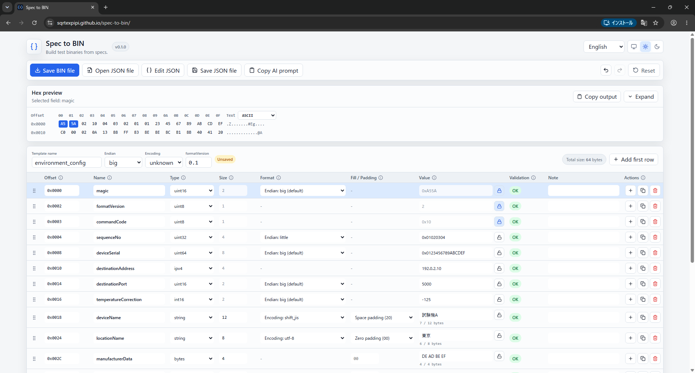
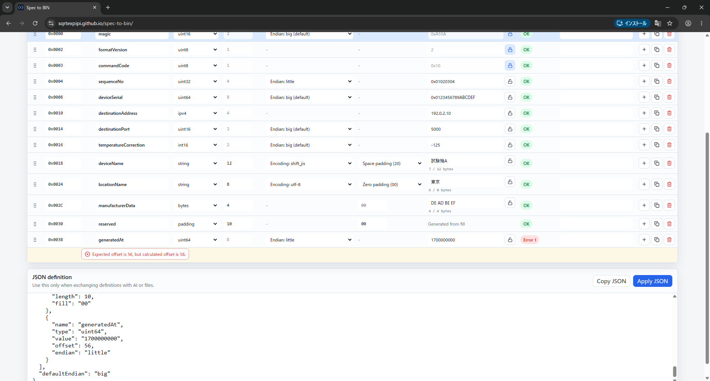

# Spec to BIN User Guide

Spec to BIN is a browser tool for generating test binary files from structured JSON definitions. It is intended for communication packets, embedded settings, EEPROM data, initialization BIN files, and test payloads.

Unlike a general-purpose hex editor, its primary workflow is to define fields, edit values, validate the structure, and export a `.bin` file rather than reverse-engineer an existing binary.

- [Open the web app](https://sqrtexpipi.github.io/spec-to-bin/)
- [Template format reference](./template-format.md)
- [JSON Schema](./binary-template.schema.json)

## 1. Data handling

Your JSON, field values, and generated BIN remain in the browser. The app does not upload them or send telemetry.

Sending a specification to an external AI or posting JSON in a GitHub Issue happens outside Spec to BIN. Do not send customer specifications, credentials, internal protocol details, or production data to an external service.

## 2. Web and offline distributions

| Distribution | Use case | How to open it |
| --- | --- | --- |
| Web/PWA | Normal use and immediate access to the latest version | Open the public URL in Chrome or Edge |
| Offline ZIP | Restricted networks and local archival | Download a ZIP from [Releases](https://github.com/SqrtExpipi/spec-to-bin/releases), extract it, and open `Spec-to-BIN-Offline.html` |

The regular web build is not intended to be opened directly with `file://`. Use the self-contained offline ZIP from a Release for that workflow.

## 3. Quick workflow

1. Select **Open JSON file** and load a template.
2. Edit values and definitions in the table.
3. Confirm that each row reports `OK` under Validation.
4. Inspect the generated bytes in Hex preview.
5. Select **Save BIN file**.
6. Select **Save JSON file** when you also need to retain the definition.

Errors block preview, copy, and BIN export to prevent an invalid file from being generated. Warnings do not block generation, but should still be reviewed.

## 4. Screen layout



### Toolbar

| Action | Description |
| --- | --- |
| Save BIN file | Saves the validated byte sequence as `.bin`. |
| Open JSON file | Loads a template and replaces the current table. Unsaved changes require confirmation. |
| Edit JSON | Opens the JSON exchange area. Select **Apply JSON** after editing. |
| Save JSON file | Saves the current template and values. This is separate from BIN export. |
| Copy AI prompt | Copies instructions matching the current template contract. |
| Undo / Redo | Reverts or reapplies recent template edits. |
| Reset | Replaces the current template with a blank template or a general field-type sample. |

### Hex preview

The preview shows generated bytes as offsets, Hex, and decoded text. Selecting a table row highlights the bytes belonging to that field.

You can manually switch the text interpretation between ASCII, UTF-8, and Shift_JIS. This changes only the text column, not the generated bytes. Numeric or control bytes that are not printable text are shown as dots or other replacement characters.

**Copy output** provides these common formats:

- `0xDE, 0xAD, 0xBE, 0xEF`
- `DE AD BE EF`
- C array
- Python `bytes`
- C# `byte[]`

## 5. Template settings

| Setting | Description |
| --- | --- |
| Template name | JSON `name`, also used for default output file names. |
| Endian | Default byte order for multi-byte numeric fields without an override. |
| Encoding | Default encoding for string fields without an override. |
| formatVersion | Template contract version. Use `0.1` for v0.1. |

`unknown` explicitly records that a value could not be determined. It is not a generation default. An unresolved required endian or encoding produces an error.

## 6. Editing fields

Each row is one field in output order. Calculated offsets come from row order and field sizes.

- Drag the left handle to reorder a row.
- Select `+` to add a row immediately below it.
- Use Duplicate to copy the row.
- Use Delete to remove it.
- Use **Add first row** to insert at the beginning.

Adding, duplicating, deleting, or reordering a row changes the calculated offsets of later fields.

### Multiple-row operations

Use the checkbox at the left of each row to show the selection toolbar. Selected rows can be duplicated, copied and pasted inside the editor, moved, deleted, or treated as one record and repeated.

**Repeat** expands the selected rows into the existing flat `fields` array; it does not introduce a new JSON field type. The count is the total number of records including the original. Name modes can keep names, append `_1` / `_01`, or increment an existing numeric suffix. Enable Offset recalculation when the expanded result should use consecutive expected offsets.

**Generate test values** applies only to selected, unlocked fixed-length `string` fields. It uses each field's effective Encoding and Size in bytes. Available modes include ASCII/full-width maximum, preserving the current prefix, custom fill, alphabet/digit repetition, empty, one byte short, and intentional one-byte overflow. When full-width characters cannot fill the exact byte count, choose whether to finish with ASCII, remain short, or skip that field.

### Offset

The Offset input is the **expected offset** written in a specification. It validates the layout; it does not place a field at an arbitrary position.

```text
calculated offset = sum of all preceding field sizes
```

If an expected offset differs from the calculated offset, export is blocked. Represent an explicit gap in the specification with a `padding` field instead of skipping the Offset value.

### Size

Numeric and `ipv4` sizes are fixed by type. For `bytes`, `string`, and `padding`, Size edits the JSON `length` in bytes.

### Fixed values

The lock beside Value corresponds to JSON `fixed`. It prevents accidental edits in the normal UI. It is not a security boundary and does not prevent someone from modifying the JSON itself.

### Note and needsReview

Note records specification details or uncertainty found by AI. A field with `needsReview: true` blocks BIN export until a person resolves it. After review, remove `needsReview` or set it to `false` through JSON editing.

## 7. Field types

| Type | Size | Example | Purpose |
| --- | ---: | --- | --- |
| `uint8` | 1 | `15`, `0x0F`, `F` | Unsigned 8-bit integer |
| `uint16` | 2 | `5000`, `0x1388` | Unsigned 16-bit integer |
| `uint32` | 4 | `0x01020304` | Unsigned 32-bit integer |
| `uint64` | 8 | JSON `"0x0123456789ABCDEF"` | Unsigned 64-bit integer |
| `int8` | 1 | `-10` | Signed 8-bit integer |
| `int16` | 2 | `-125`, `-0x10` | Signed 16-bit integer |
| `int32` | 4 | `-100000` | Signed 32-bit integer |
| `int64` | 8 | JSON `"-9223372036854775808"` | Signed 64-bit integer |
| `bytes` | `length` | `DE AD BE EF` | Explicit bytes or a repeated fill byte |
| `string` | `length` | `DEVICE-A` | Fixed-byte-length text |
| `ipv4` | 4 | `192.0.2.10` | IPv4 address |
| `padding` | `length` | fill: `00` | Reserved or unused space |

There is no dedicated Port type. Use a numeric type such as `uint16` according to the specification.

## 8. Numeric input and endian

| Input | Interpretation |
| --- | --- |
| `15` | Decimal 15 |
| `0010` | Decimal 10 |
| `0x0010` | Hex 0x10, decimal 16 |
| `F`, `7FFF` | Hex because A-F is present |
| `-0x10`, `-A` | Negative hexadecimal |

Digits-only input is decimal. Add `0x` when hexadecimal intent should be explicit.

JSON values for `uint64` and `int64` must be strings to prevent JavaScript number precision loss. They can be entered normally in the GUI.

Endian controls multi-byte numeric order. For a `uint16` value of `0x1234`:

```text
big:    12 34
little: 34 12
```

Numeric endian does not apply to `uint8`, `int8`, `ipv4`, raw `bytes`, or ordinary encoded strings.

## 9. bytes, fill, and padding

### bytes.value

Use `value` for explicit bytes. Accepted forms include:

```text
DEADBEEF
DE AD BE EF
DE, AD, BE, EF
0xDE, 0xAD, 0xBE, 0xEF
{ 0xDE, 0xAD, 0xBE, 0xEF }
```

The decoded byte count must exactly match `length`.

### bytes.fill

Use `fill` to repeat one byte for the entire length. `length: 4` with `fill: "FF"` generates `FF FF FF FF`. A `bytes` field cannot have both `value` and `fill`.

### padding

Use `padding` for reserved or unused regions. It has no `value`; it uses `length` and an optional one-byte `fill`. Omitted fill defaults to `00`.

`bytes` represents data, while `padding` records structural intent. Use the type that matches the specification even when the resulting bytes would be identical.

## 10. Fixed-length strings

A `string` requires `length`, `encoding`, `padding`, and `value`.

```json
{
  "name": "displayName",
  "type": "string",
  "offset": 0,
  "length": 12,
  "encoding": "shift_jis",
  "padding": "zero",
  "value": "通信"
}
```

Supported encodings are `ascii`, `utf-8`, and `shift_jis`. Length is measured after encoding, in bytes rather than characters.

```text
"通信"
UTF-8:     E9 80 9A E4 BF A1 (6 bytes)
Shift_JIS: 92 CA 90 4D       (4 bytes)
```

`zero` pads with `00`; `space` pads with `20`. Text that exceeds the fixed length is rejected instead of truncated. A character that cannot be represented by the selected encoding is also an error.

## 11. Loading and editing JSON

A minimal useful template looks like this:

```json
{
  "formatVersion": "0.1",
  "name": "example_packet",
  "defaultEndian": "big",
  "defaultEncoding": "utf-8",
  "fields": [
    {
      "name": "messageType",
      "type": "uint16",
      "offset": 0,
      "value": "0x000F"
    },
    {
      "name": "label",
      "type": "string",
      "offset": 2,
      "length": 8,
      "encoding": "ascii",
      "padding": "zero",
      "value": "TEST"
    }
  ]
}
```

In Edit JSON, pasted changes do not reach the table until you select **Apply JSON**. Correct syntax and definition errors before applying.

Unknown properties are preserved where possible, but preservation does not mean Spec to BIN implements their behavior. Review the warnings.

## 12. Creating JSON with AI

1. Select **Copy AI prompt**.
2. Give the prompt and specification to the AI you choose.
3. Save the returned JSON or paste it into Edit JSON.
4. Compare Offset, Size, Endian, Encoding, and fixed values with the source specification.
5. Resolve `needsReview`, `unknown`, errors, and warnings.
6. Compare the Hex preview with expected bytes before exporting.

Do not treat AI-generated JSON as authoritative. A person should verify:

- field order and omissions
- byte lengths and expected offsets
- signedness and endian
- encoding and string padding
- fixed values, reserved areas, and externally calculated values
- CRC and checksum values

v0.1 does not calculate CRC or checksums. If the specification gives an algorithm but no concrete value, the AI should emit `needsReview: true` rather than invent a value. Calculate it externally and enter the result manually.

## 13. Validation



| Message | What to check |
| --- | --- |
| Offset mismatch | Missing fields, sizes, `padding`, and row order |
| Number out of range | Signedness, bit width, and decimal/hex interpretation |
| Endian is unknown | Byte order in the specification |
| Encoding is unknown | Character encoding in the specification |
| String exceeds length | Encoded byte count, not character count |
| bytes length mismatch | Decoded `value` byte count and `length` |
| needsReview | Note and source specification, then resolve the uncertainty |

Field-specific problems appear directly below the affected row. Template-wide issues may appear near the JSON definition area.

## 14. Pre-export checklist

- Template and output names match the intended use.
- Every validation result has been reviewed.
- Field order, types, sizes, and offsets match the specification.
- Endian and encoding were not guessed.
- Fixed values and reserved areas are correct.
- Encoded string byte counts and padding are correct.
- The beginning, end, and important fields in Hex preview were inspected.
- Externally calculated CRC or checksum values were updated.
- The JSON definition was saved for reproducibility.

## 15. Current limits

- The test scope targets current stable Google Chrome and Microsoft Edge.
- CRC, checksum, JSON repeat structures, variable-length structures, bit fields, floating-point fields, and conditional fields are not supported. Selected rows can still be expanded into flat fields from the GUI.
- Existing BIN files cannot be parsed back into templates.
- Hex preview is limited to the first 8 KiB and text copy to 64 KiB.
- JSON input is limited to 5 MiB, fields to 5,000, one variable-size field to 16 MiB, and generated BIN to 64 MiB.

See the [README](../README.md) and [template format reference](./template-format.md) for the latest support information.

